# T05: Accés Remot. Connexió via SSH (tasca individual)

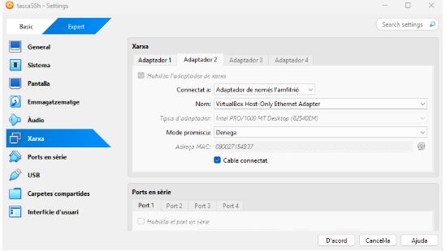

Primer posem el primer adaptador en NAT i el segon l’habilitem i el posem en amfitrió.

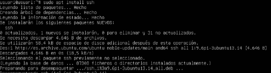

Al entrar a la màquina virtual al que hem de fer és instalar el ssh amb la comanda “sudo apt install ssh”

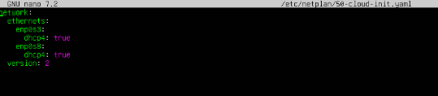

Entrem al fitxer sudo nano /etc/netplan/50-cloud-init.yaml i modifiquem las ips.

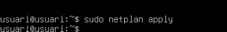

I fem un sudo netplan apply.

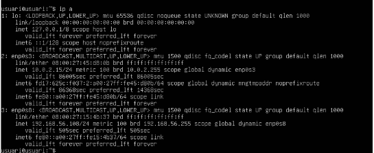

I fem un ip a per veure las nostras ip’s.

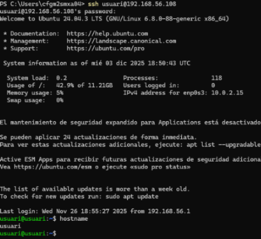

Entrem al ssh i al conactem a la nostre màquina, i fem un hostname. 

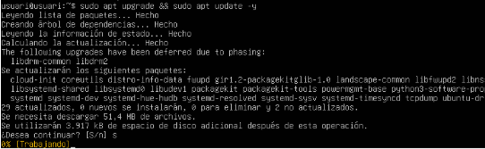

Fem un sudo apt upgrade && sudo apt update -y per actualitzar els paquets.

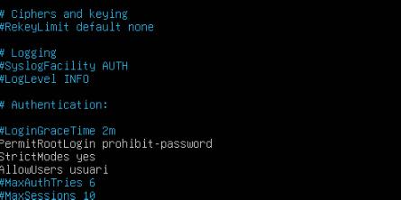

Entrem al arxiu “sudo nano /etc/ssh/sshd_config”
I editem al logingracetime 2m i agreguem 
AllowUsers usuari1 i usuari2

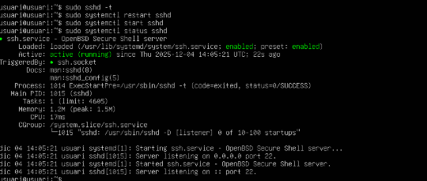

I fem un “sudo sshd -t” per verificar l’arxiu que estigui bé 
Un systemctl restart sshd 
Un systemctl start sshd
I un status per veure l’estat del sshd.

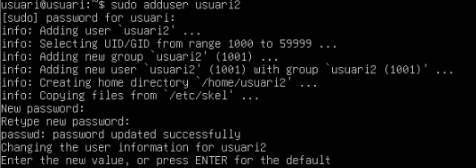

Ara hem de crear un usuari que es digui usuari2  i configurar que no es pugui connectar per ssh aquest usuari2.

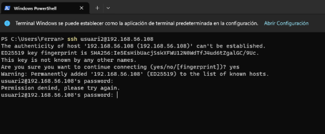

He pogut comprovar com l’usuari2 no funcionar. 

#PART DEL TÚNEL

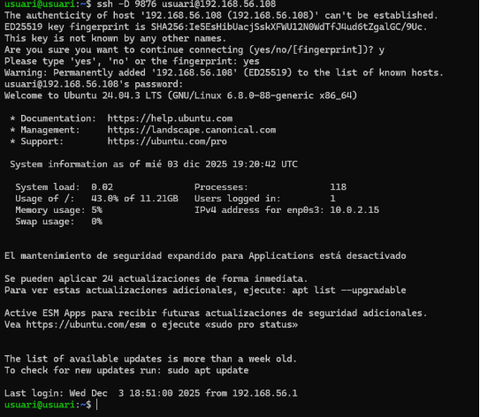

Fem un ssh -D 9876 usuari@192.168.56.108 per configurar el tunel amb redirecció dinamica. 

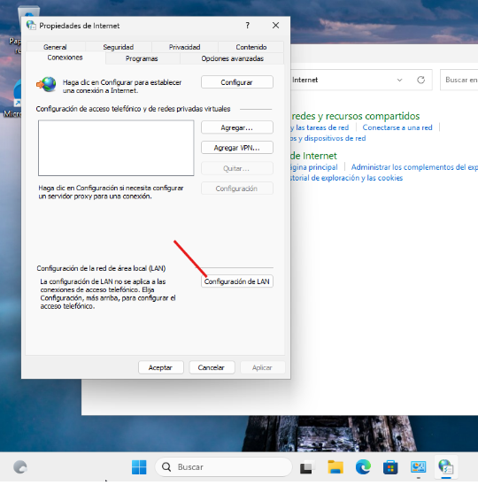

Instal·lem una màquina windows i només entrar busquem al panel de control propietats d’internet i li donem a configuració de LAN.

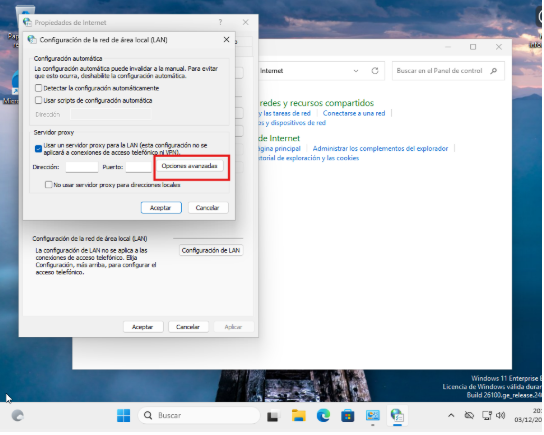

Un cop a dintre treiem la primera opció i posem la opció que esta a la captura i entrem a opcions avanzadas.

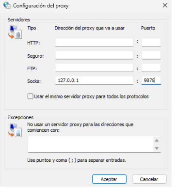

Al lloc on posa Socks posem la ip 127.0.0.1 i 9876 al port. 

#instal·lar wireshark

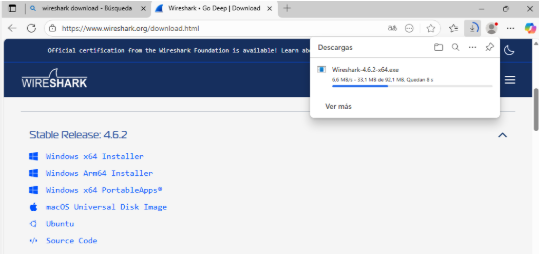

Instal·lem el wireshark dins de la màquina client. 

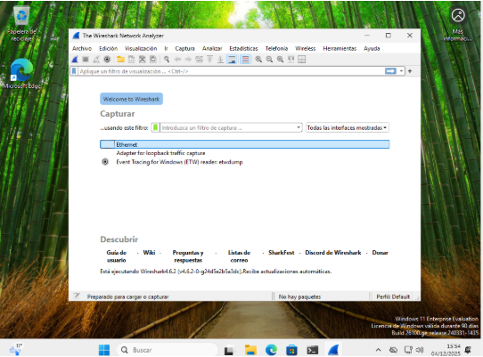

Aqui podem veure com ja he entrar al wireshark.

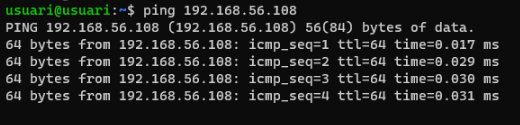

Fem un ping de la nostra ip a la terminal de la màquina client. 

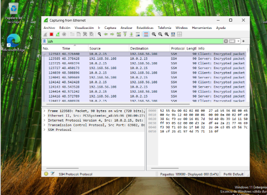

Posem ssh al buscador per veure las ip’s funcionan.

#VIDEO SSH AMB CLAU PÚBLICA I PRIVADA

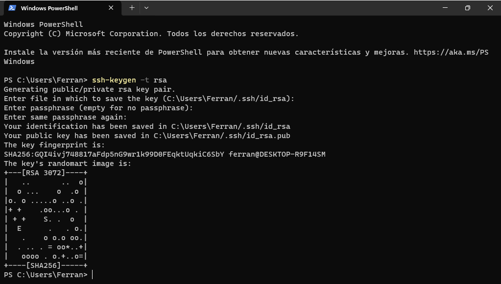

Entrem a la terminal del client i fem un ssh-keygen -t rsa. 

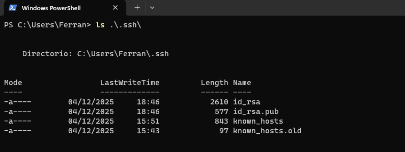

Seguidament fem un ls .\.ssh\ per veure el directori i els lastwritetime i el length Name. 

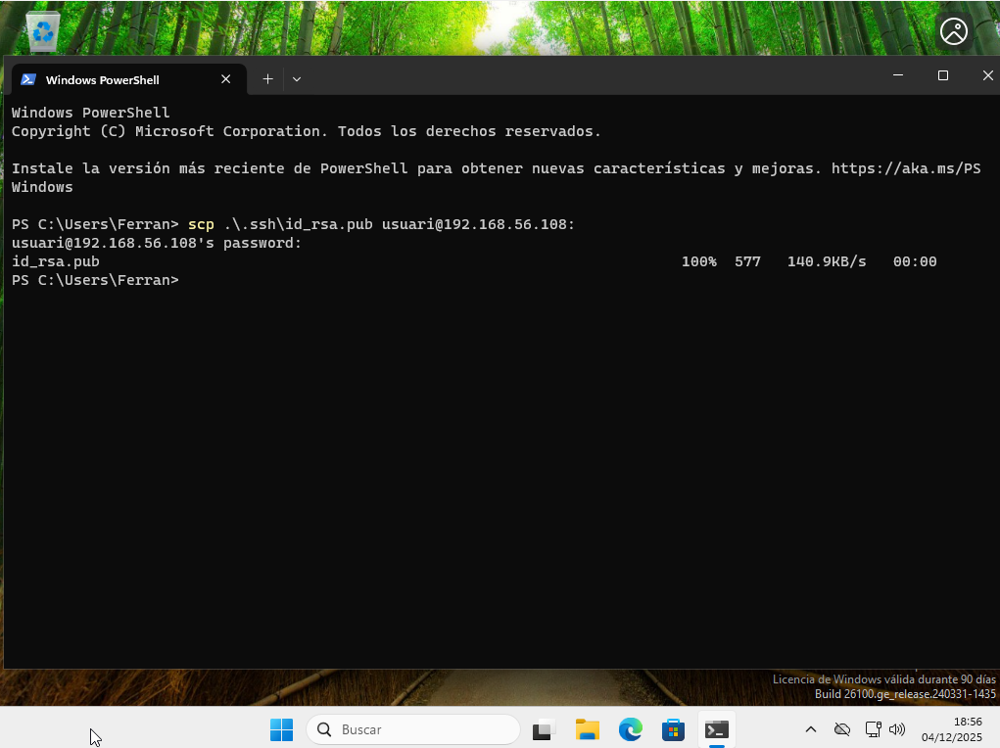

I despres fem un “ scp .\.ssh\id_rsa.pub usuari@192.168.56.108:”

sobretot fer aquesta comanda amb la ip corresponen. 

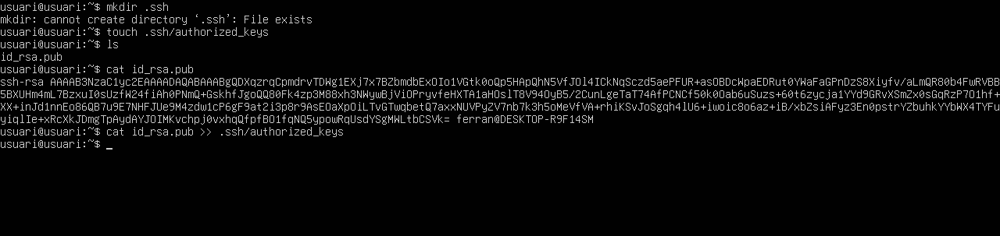

Fem un mkdir .ssh
seguidament un touch .ssh/authorized_keys
ls
cat id_rsa.pub
cat id_rsa.pub >> .ssh/authorized_keys

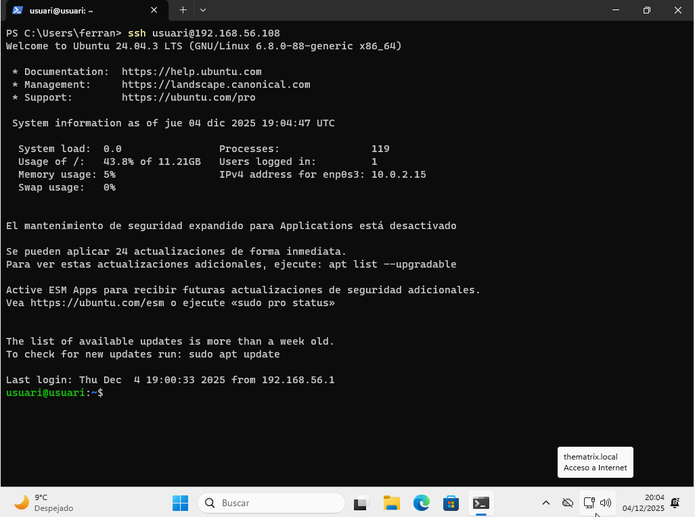

I despres de fer las comandas que s’han de fer a la màquina principal tornem a la màquina client i fem un ssh usuari@192.168.56.108 per veure que no et demana contrasenya per entrar. 

