# T06: Accés remot. Escriptori remot (RDP) (tasca individual)

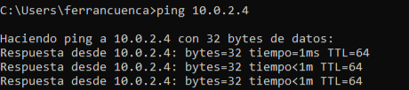

primer fem un ping desde windows a zorin 

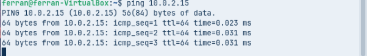

I de zorin a windows per veure si es veuen las màquines

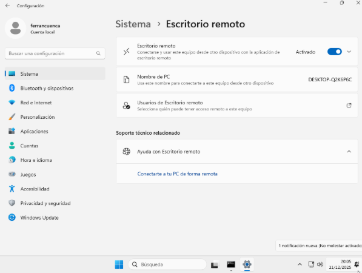

Un cop fet al pring a la màquina de windows entrem a ajustes a la part de sistema i activem l’escritori remot 

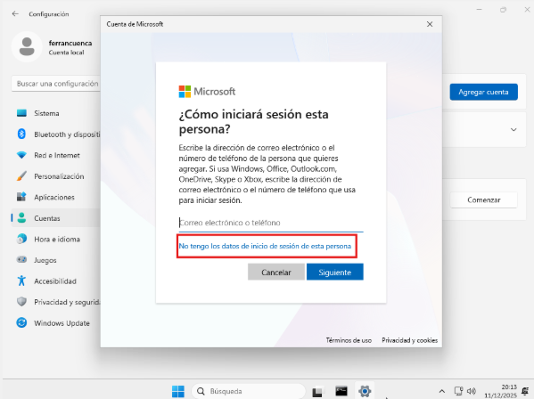

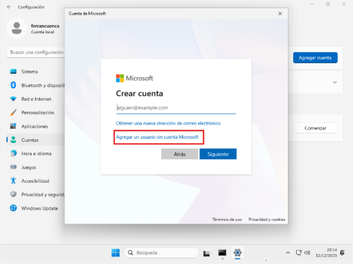

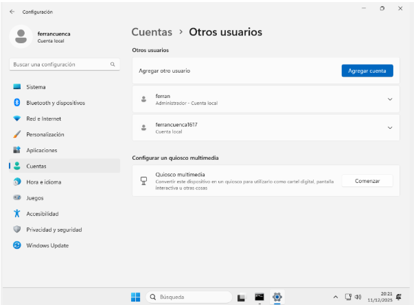

Un cop agregada la conta de microsoft podem veure que sens a posat directament a cuentas > altres usuaris que es on la voliem tenir.

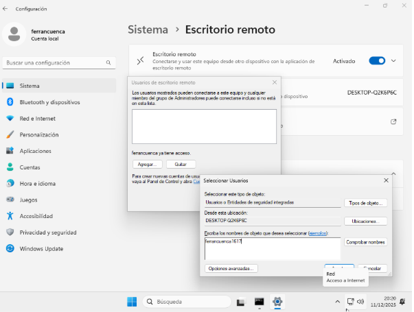

Anem els usuaris de escritorio remoto i posem el nom de la conta creada en el meu cas ferrancuenca1617 i l’agreguem 

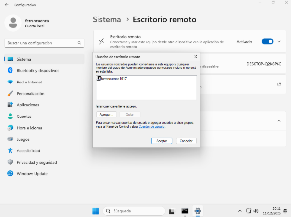

un cop agregada la conta li donem a acceptar. 

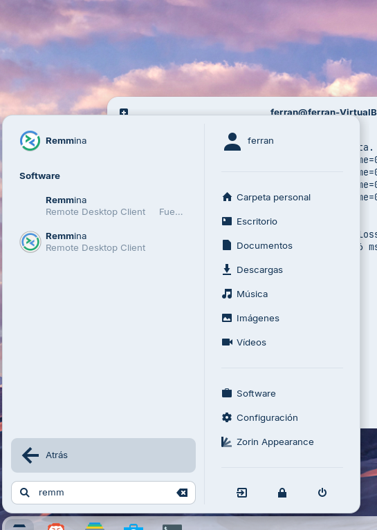

Quan instal·lem la màquina zorin ja be al remmina instal·lat llavors el busquem i entrem a la aplicació. 

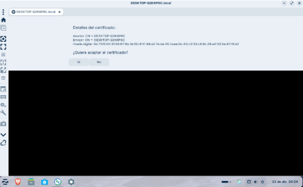

Un cop entrem posem en nostre desktop en el meu cas es DESKTOP-Q2K6P6C.local i ens connectem i li donem a si acceptar el certificat

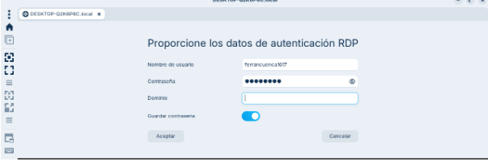

Posem el nostre nom d’susuari creat anteriorment que es ferrancuenca1617 i una contrasenya segura.

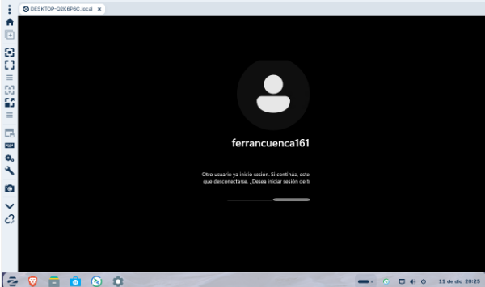

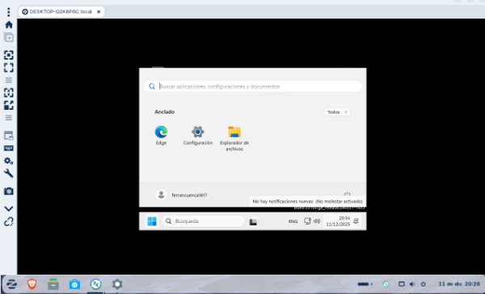

Si és la primera vegada que ens connectem, ens pot sortir un avís de seguretat sobre el certificat.

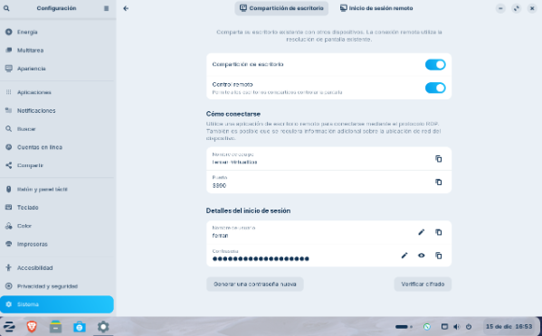

Ara entrem a la màquina de zorin entrem a ajustes i a sistema haurem de activar la compartició del escriptori.

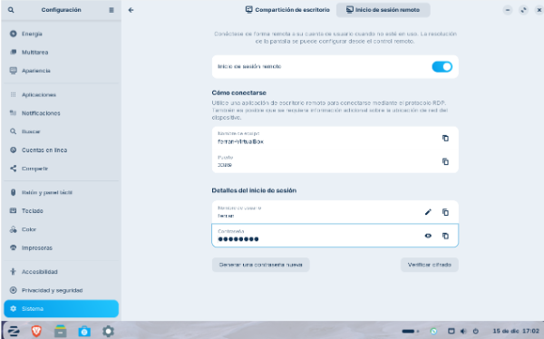

I desbloquejar el inici de sessió remota on abaix de tot ens demana una contrasenya posem una per enrecordar-nos ja que despres per conectar-nos ens la demanara. 

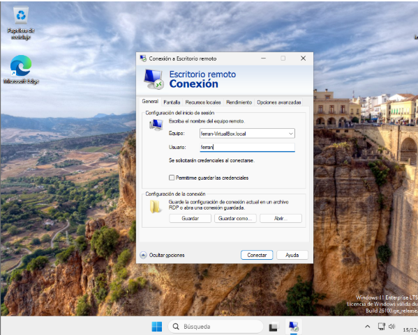

Entrem a connexió a escritori remot i posem l’equip i al nom d’usuari posats anteriorment en el meu cas: ferran-VirtualBox.local i el nom d’usuari ferran i li donem a connectar

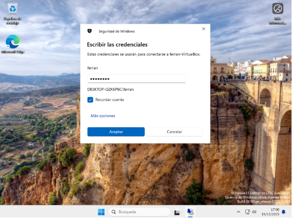

Un cop el connectem ens demana la contrasenya de l'usuari i personalment li dono a recordar conta i acceptem 

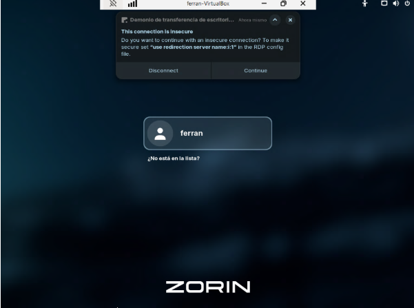

Li dono continuar a la compartició i poso una altre vegada la contrasenya.

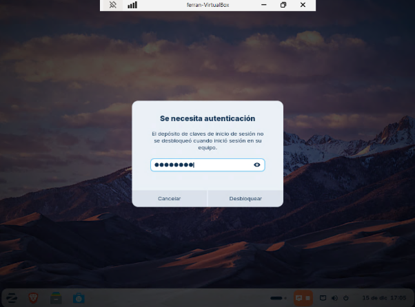

Identifico de que sóc jo al que amb vull connectar de una máquina a una altre. Ho desbloquejem 

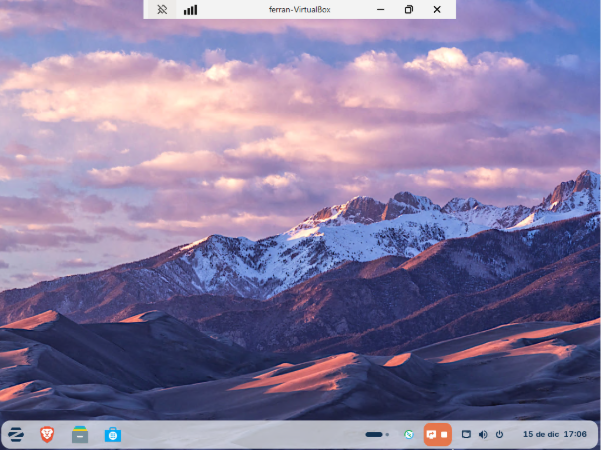

I podem veure com des d'un client ens hem connectat connectat a un servidor Windows i estem veient el seu escriptori.

