#T09: Servidor fitxers Linux. NFS (tasca individual)

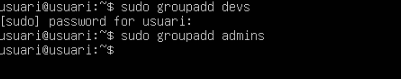

He hagut de crear dos nous grups amb sudo groupadd devs i sudo groupadd admins

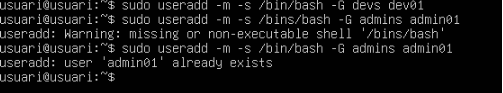

Fem la comanda 
sudo useradd -m -s /bin/bash -G devs dev01
sudo useradd -m -s /bin/bash -G admins admin01
Per crear els usuaris dins del grups creats anteriorment 

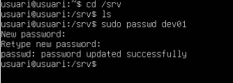

Fem un 
cd /srv
ls 
i li posem contrasenya a l'usuari dev01 amb la comanda sudo passwd dev01

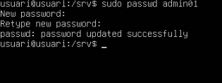

Fem amb al mateix amb el usuari admin01 li posem contrasenya 

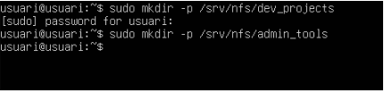

Fem un sudo mkdir -p /srv/nfs/dev_projects
sudo mkdir -p /srv/nfs/admin_tools 
al que hem fet amb aixo ha sigut crear las carpetas dev_projects i admin_tools

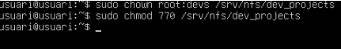

Fem sudo chown root:devs /srb/nfs/dev_projects i despres un sudo chmod 770 /srv/nfs/dev_projects per configura correctament permisos i propietaris per garantir l’accés segur al directori compartit.

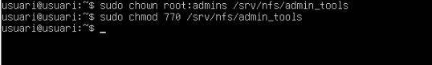

Ara fem al mateix amb la carpeta de admin_tools

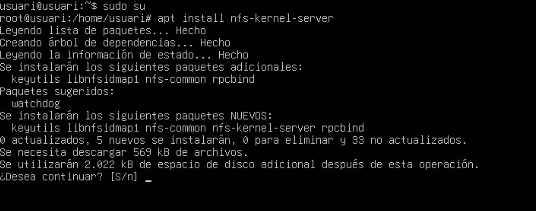

Ens posem en sudo su i amb la comanda apt install nfs-kernel-server installem. 

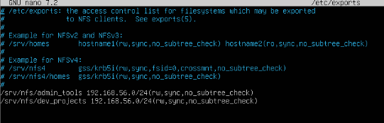

Entre a l’arxiu sudo nano /etc/exports i posem las dues linies que he posat abaix de tots els # per aixi no nomes jo tinc acces sino tothom. 

I per verificar l’arxiu al que hem de fer es 
sudo systemctl start nfs-kernel-server
sudo systemctl reload nfs-kernel-server
sudo exportfs -u 
sudo systemctl enable nfs-kernel-server

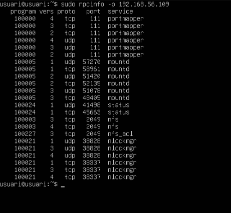

Sudo rpcinfo -p i la nostre ip en el meu cas 192.168.56.109
aixo fa que puguis veure la informació de la teva ip. 

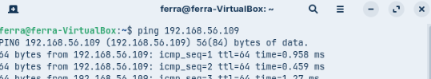

Ara orbrim la màquina del client i fem un ping 192,168,65.109 per veure si va. 

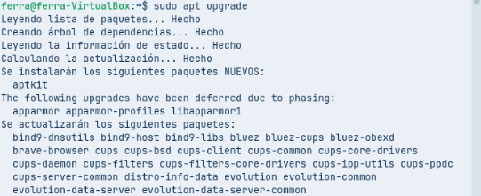

Fem un sudo apt upgrade només entrar a la màquina 

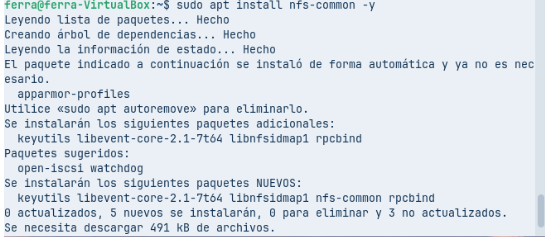

I instal·lem nfs-common amb la comanda sudo apt install nfs-common -y 

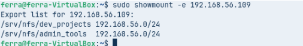

Fem un sudo showmount -e 192.168.56.109 i podem veure desde la màquina del client que l’arxiu de exports esta be i et surten les linies que habias de afegir. 

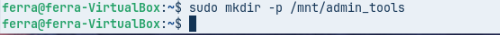

Fem un sudo mkdir -p /mnt/admin_tools dins de la màquina client la creem 

Munta el recurs NFS al client per accedir als fitxers de forma remota.

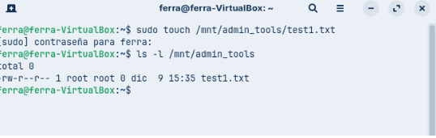

Comprova que la creació de fitxers al punt de muntatge funciona i respecta els permisos del servidor.

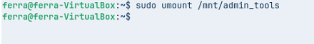

Amb aquest comandament es desmunta el directori /mnt/admin_tools, alliberant el punt de muntatge.

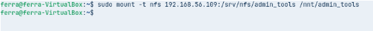

Amb aquesta ordre es munta el directori NFS remot al punt de muntatge /mnt/admin_tools per poder-hi accedir des de la màquina local.

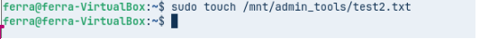

Es crea l’arxiu test2.txt dins del directori muntat /mnt/admin_tools, comprovant que el punt de muntatge és accessible i permet l’escriptura.

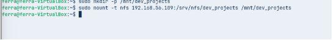

Crea el directori de muntatge i munta el recurs NFS al sistema per poder accedir als fitxers compartits.

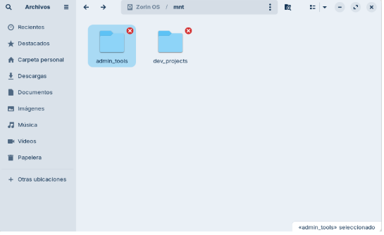

Quan anem a las carpetas a l’apartat mns ens hauria de sortir las dues que hem creat anteriorment la de admin_tools i la de dev_projects. 

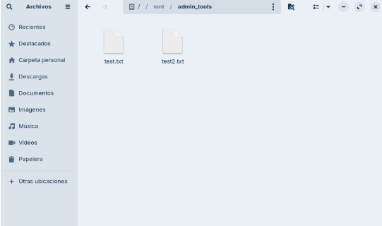

A la que entrem a la de admi_tools ens hauria de posar els dos test.txt dintre de la carpeta. i a la de dev_projects no ens ha de sortir res

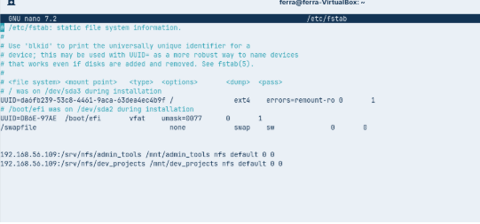

Dins de la màquina de client entrem al arxiu sudo nano /etc/fsfab i fem dos intros abaix de tot del fitxer i posem les dues linies que he posat amb la meva ip per Afegir les entrades NFS al fitxer /etc/fstab per muntar automàticament els recursos compartits cada vegada que s'inicia el sistema.

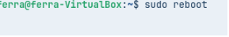

Fem un reboot de la màquina un cop acabat el fitxer 

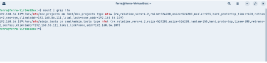

Tornem a entrar a la terminal i fem un mount | grep nfs i ja haurem acabat la tasca del NFS completament i ben feta. 

